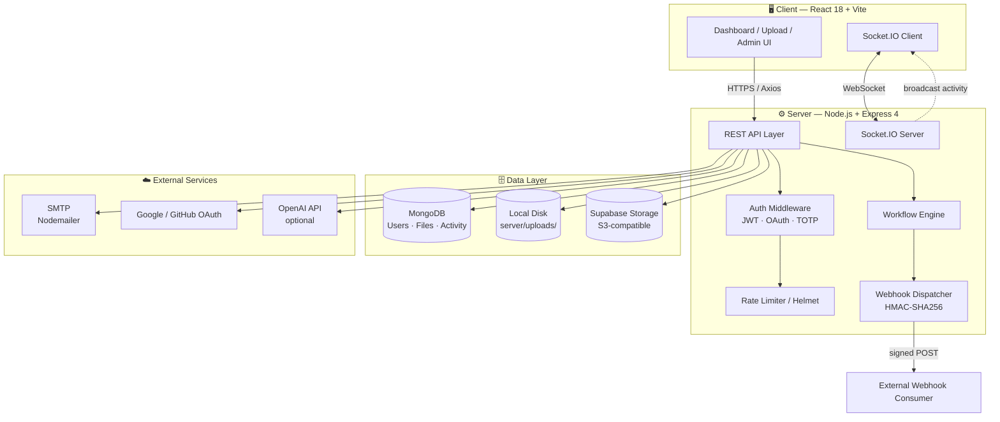
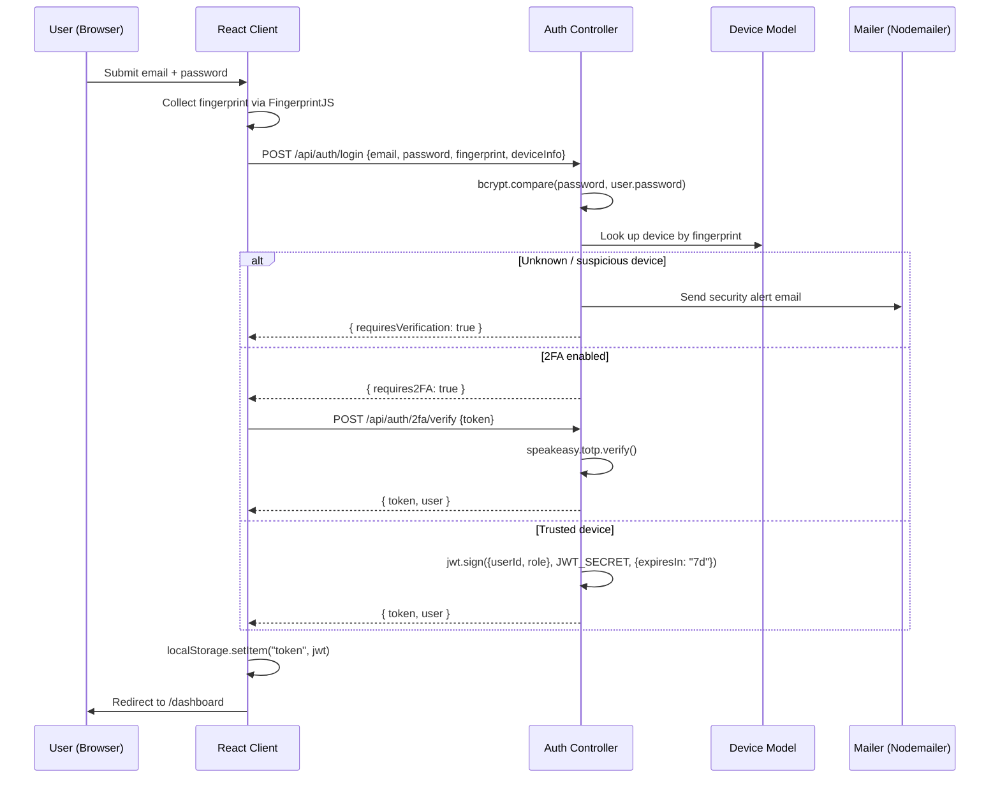
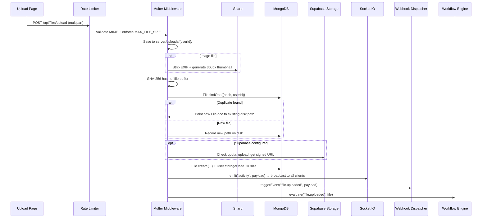

<div align="center">

# 🔐 VaultFS

### Enterprise-Grade Self-Hosted File Management System

[](https://nodejs.org)
[](https://reactjs.org)
[](https://mongodb.com)
[](https://vitejs.dev)
[](https://socket.io)
[](https://tailwindcss.com)
[](https://expressjs.com)
[](./LICENSE)

<br/>

**Secure, real-time file collaboration for teams and organizations — self-hosted, zero vendor lock-in.**

Self-hosted · SHA-256 deduplication · 4-tier RBAC · JWT + TOTP 2FA · Signed webhooks · Live in production

[](https://www.vaultfs.in/)
&nbsp;&nbsp;&nbsp;
[](https://github.com/kanhaiyaray/VaultFS-Enterprise-File-Management-System)

</div>

---

## 📋 Table of Contents

- [What is VaultFS?](#-what-is-vaultfs)
- [Architecture](#-architecture)
- [Tech Stack](#-tech-stack)
- [Features](#-features)
- [In-Browser Preview Engine](#️-in-browser-preview-engine)
- [Admin Dashboard](#️-admin-dashboard)
- [Project Structure](#️-project-structure)
- [Quick Start](#-quick-start)
- [Environment Variables](#️-environment-variables)
- [API Reference](#-api-reference)
- [Database Models](#️-database-models)
- [Security Implementation](#-security-implementation)
- [Key Data Flows](#-key-data-flows)
- [Development vs Production](#-development-vs-production)
- [NPM Scripts](#-npm-scripts)
- [Key Dependencies](#-key-dependencies)
- [Production Checklist](#️-production-checklist)
- [Roadmap](#️-roadmap)
- [Contributing](#-contributing)
- [License](#-license)

---

## 📦 What is VaultFS?

VaultFS is a **full-featured, self-hosted file management platform** built for teams and enterprises that want cloud-grade functionality without giving up control of their data.

| | |
|---|---|
| 🗄️ **Your storage** | Files live on your own disk (or your own Supabase/S3 bucket) — no third-party file host |
| 🗃️ **Your database** | Metadata stays in your own MongoDB instance |
| 🔐 **Your governance** | Auth, sharing, retention, and workflows are entirely under your control |

Out of the box it ships with a modern dark/light UI, real-time updates via Socket.IO, advanced sharing controls, full file versioning, boolean full-text search, an in-browser preview engine for 9+ file types, and a complete admin dashboard — with zero vendor lock-in.

---

## 🏗️ Architecture



---

## 🧱 Tech Stack

| Layer | Technology | Purpose |
|---|---|---|
| **Frontend** | React 18 + Vite 8 + Tailwind CSS 3 + React Router 6 | UI, routing, styling |
| **Real-time** | Socket.IO Client / Server 4 | Live activity feeds, notifications |
| **Backend** | Node.js 20+ + Express 4 | REST API, business logic |
| **Database** | MongoDB 6+ with Mongoose ODM | Persistent data storage |
| **Auth** | JWT (localStorage) + Passport.js + TOTP (speakeasy) + bcrypt | Sessions, OAuth, 2FA |
| **Storage** | Local disk + Supabase Storage (S3-compatible) | File storage with quota enforcement |
| **File Processing** | Sharp (thumbnails) + Multer (uploads) + archiver + unzipper | Upload pipeline |
| **Email** | Nodemailer (SMTP — Gmail, SendGrid, Mailgun) | Transactional email |
| **Preview Engines** | Marked.js + Prism.js + Mammoth.js + SheetJS + JSZip + epub.js | In-browser previews |
| **Security** | Helmet.js + express-rate-limit + FingerprintJS + HMAC-SHA256 | Hardened HTTP layer |
| **AI (optional)** | OpenAI API | Folder suggestions, duplicate detection |

---

## ✨ Features

<details open>
<summary><strong>🔐 Authentication & Security</strong></summary>
<br/>

- **JWT sessions** — 7-day expiry, XSS-mitigated via CSP headers
- **OAuth 2.0** — Google and GitHub sign-in via Passport.js
- **TOTP Two-Factor Authentication** — speakeasy-based, RFC 6238, QR code setup
- **Device fingerprinting** — FingerprintJS flags unknown devices and triggers email alerts on suspicious logins
- **Password reset & email verification** — full token-based flows
- **Rate limiting** — 10 uploads/min · 200 API requests/15 min
- **Permanent & time-based user bans** — managed from the admin panel
- **GDPR compliance** — account data export and self-deletion flows

</details>

<details>
<summary><strong>📁 File Management</strong></summary>
<br/>

- **Drag-and-drop upload** with real-time progress indicators
- **Import from URL** — pull files directly from any public URL
- **File versioning** — full version history with one-click restore
- **SHA-256 deduplication** — identical files share a single disk object
- **Bulk operations** — multi-select delete, ZIP download, or batch tag editing
- **30-day soft-delete trash** with restore or permanent deletion
- **Starred files** and custom color labels per user
- **Smart Folders** — rule-based virtual collections evaluated client-side

</details>

<details>
<summary><strong>🔗 Sharing & Collaboration</strong></summary>
<br/>

- **Advanced share links** — password protection, expiry, download limits, view-only mode
- **Public gallery** of shared files, browsable without an account
- **Team workspaces** with role-based access: `owner` · `admin` · `editor` · `viewer`
- **File Requests** — public upload slugs accepting submissions from unauthenticated users
- **Real-time activity feed** — Socket.IO broadcasts every file event instantly
- **Webhooks** — HMAC-SHA256 signed payloads with per-event filtering

</details>

<details>
<summary><strong>🔍 Organization & Search</strong></summary>
<br/>

- **Full-text search** with boolean operators (`AND` / `OR` / `NOT`) and saved queries
- **Smart Folders** — client-side virtual collections from customizable rules
- **File diff viewer** — side-by-side comparison of text files or file versions
- **Tags & descriptions** — manual, or AI-assisted via optional OpenAI integration

</details>

---

## 🖼️ In-Browser Preview Engine

| File Type | Technology | Notes |
|---|---|---|
| Images (JPG, PNG, WEBP) | Sharp server-side thumbnails | EXIF stripped for privacy |
| Video / Audio | HTML5 `<video>` / `<audio>` | Native browser playback |
| PDF | Embedded `<iframe>` viewer | No plugin required |
| DOCX | Mammoth.js → HTML (client-side) | Preserves basic formatting |
| XLSX / CSV | SheetJS → interactive table | Sortable columns |
| PPTX | JSZip → extracted slide text | Text-only extraction |
| Code (30+ languages) | Prism.js syntax highlighting | Theme-matched |
| Markdown | Marked.js, split-pane live editor | Real-time preview |
| EPUB | epub.js (client-side) | Full reader experience |

---

## 🛠️ Admin Dashboard

| Section | Capabilities |
|---|---|
| **Users** | List, search, filter, create, edit, ban/unban, force password reset, impersonate, CSV export |
| **Files** | Browse all files across all users, full-text search, delete, storage hogs, orphan cleanup |
| **Stats** | Storage analytics, upload trend charts, MIME breakdown, top uploaders leaderboard |
| **Activity Log** | Full audit trail — filter by action, user, date range, IP |
| **Announcements** | Broadcast in-app + email messages to all users or specific roles |
| **Branding** | Custom app name, logo, favicon, colors, maintenance mode, feature toggles |
| **Workflows** | Visual drag-and-drop builder for automated actions triggered by time, file events, or webhooks |

---

## 🗂️ Project Structure

```
VaultFS/
├── client/                          # React 18 + Vite 8 frontend
│   ├── public/                      # Static assets
│   ├── vite.config.js               # Vite build config + API proxy
│   └── src/
│       ├── components/              # 40+ reusable UI components
│       │   ├── AdvancedSearch.jsx
│       │   ├── AdvancedShareModal.jsx
│       │   ├── BrandingProvider.jsx
│       │   ├── BulkTagEditor.jsx
│       │   ├── DeviceManagement.jsx
│       │   ├── EncryptionModal.jsx
│       │   ├── FileDiffViewer.jsx
│       │   ├── FileVersionHistory.jsx
│       │   ├── OfficePreview.jsx
│       │   ├── SmartFolders.jsx
│       │   ├── VirtualFileBrowser.jsx
│       │   └── WebhooksTab.jsx
│       ├── context/                 # AuthContext · ThemeContext · BrandingContext · ActionHistoryContext
│       ├── hooks/                   # useSocket · useLocalStorage · useFileOrganizer
│       ├── pages/                   # 16 route-level page components
│       └── utils/                   # api.js · helpers.js · encryption.js · deviceFingerprint.js
│
├── server/                          # Node.js / Express 4 API
│   ├── index.js                     # Express + Socket.IO entry point
│   ├── controllers/                 # admin · auth · file · webhook · workflow · ai · share · notification
│   ├── models/                      # User · File · FileRequest · Webhook · Branding · Activity · Device · Team · Workflow
│   ├── routes/                      # /api/auth · /api/files · /api/admin · /api/webhooks · /api/workflows ...
│   ├── middleware/                  # auth.js · upload.js · rateLimiter.js
│   ├── utils/                       # activityLogger · sendMail · passport · socket · supabase · workflowEngine
│   └── uploads/                     # ⚠️ Persistent volume required in production
│
├── package.json                     # Root workspace — runs client + server concurrently
└── README.md
```

---

## 🚀 Quick Start

### Prerequisites

| Requirement | Version | Notes |
|---|---|---|
| Node.js | 20+ | Required by Sharp |
| MongoDB | 6+ | Local instance or MongoDB Atlas |
| npm | 9+ | Comes with Node.js 20 |
| SMTP server | Any | Gmail, SendGrid, Mailgun — required for email flows |
| Supabase | Optional | Required for cloud storage (falls back to local) |

### Installation

```bash
# 1. Clone the repository
git clone https://github.com/kanhaiyaray/VaultFS-Enterprise-File-Management-System.git
cd VaultFS-Enterprise-File-Management-System

# 2. Install all dependencies (root workspace + client/ + server/)
npm run install:all

# 3. Configure environment variables
cp server/.env.example server/.env
# Open server/.env and fill in your values

# 4. Start both servers in development mode
npm run dev
# → API server:    http://localhost:5000
# → React client:  http://localhost:5173
```

### Production Deployment

```bash
# 1. Build the React frontend (outputs to client/dist/)
npm run build

# 2. Start Express in production mode
NODE_ENV=production node server/index.js
```

> Always run behind a reverse proxy (nginx, Caddy) with SSL termination.

---

## ⚙️ Environment Variables

<details>
<summary><strong>server/.env</strong> — click to expand</summary>

```env
# ── Server ────────────────────────────────────────────
PORT=5000
NODE_ENV=development
CLIENT_URL=http://localhost:5173

# ── Database ──────────────────────────────────────────
MONGO_URI=mongodb://127.0.0.1:27017/vaultfs

# ── JWT ───────────────────────────────────────────────
JWT_SECRET=change-this-to-a-long-random-string   # openssl rand -hex 64
JWT_EXPIRES_IN=7d

# ── SMTP (required for all email flows) ───────────────
EMAIL_HOST=smtp.gmail.com
EMAIL_PORT=587
EMAIL_SECURE=false
EMAIL_USER=your-email@gmail.com
EMAIL_PASS=xxxx xxxx xxxx xxxx           # Gmail App Password
EMAIL_FROM="VaultFS" <noreply@vaultfs.com>

# ── File Storage Limits ───────────────────────────────
MAX_FILE_SIZE=52428800                   # 50 MB per file
DEFAULT_STORAGE_LIMIT=5368709120         # 5 GB per user

# ── Supabase Storage (optional) ───────────────────────
SUPABASE_URL=https://your-project.supabase.co
SUPABASE_SERVICE_KEY=eyJ...              # Service role key
SUPABASE_BUCKET=vaultfs

# ── OAuth — Google (optional) ─────────────────────────
GOOGLE_CLIENT_ID=
GOOGLE_CLIENT_SECRET=

# ── OAuth — GitHub (optional) ─────────────────────────
GITHUB_CLIENT_ID=
GITHUB_CLIENT_SECRET=

# ── AI Features (optional) ────────────────────────────
OPENAI_API_KEY=sk-...                    # Enables /api/ai/* endpoints
```
</details>

<details>
<summary><strong>client/.env</strong> — click to expand</summary>

```env
VITE_API_URL=http://localhost:5000
VITE_SOCKET_URL=http://localhost:5000
```
</details>

---

## 📡 API Reference

<details>
<summary><strong>Public Endpoints</strong> (no auth required)</summary>

| Method | Endpoint | Description |
|---|---|---|
| GET | `/api/branding` | Retrieve public branding configuration |
| GET | `/api/files/share/:token` | Get share link metadata |
| POST | `/api/files/share/:token/access` | Unlock a password-protected share link |
| GET | `/api/file-requests/:slug` | Get public file request info |
| POST | `/api/file-requests/:slug/submit` | Submit files to a public request |
| GET | `/api/files/public/gallery` | Browse public gallery (with search) |

</details>

<details>
<summary><strong>Auth Endpoints</strong> — <code>/api/auth/*</code></summary>

| Method | Endpoint | Description |
|---|---|---|
| POST | `/register` | Register new user account |
| POST | `/login` | Login with device fingerprint check |
| POST | `/logout` | Invalidate session |
| POST | `/2fa/setup` | Generate TOTP secret + QR code |
| POST | `/2fa/verify` | Verify TOTP token, enable 2FA |
| POST | `/2fa/disable` | Disable 2FA (requires current TOTP) |
| POST | `/forgot-password` | Send password reset email |
| POST | `/reset-password` | Reset password with token |
| GET | `/verify-email/:token` | Verify email address |
| GET | `/google` | Initiate Google OAuth2 flow |
| GET | `/github` | Initiate GitHub OAuth2 flow |
| POST | `/verify-suspicious` | Verify suspicious login |

</details>

<details>
<summary><strong>File Endpoints</strong> — <code>/api/files/*</code></summary>

| Method | Endpoint | Description |
|---|---|---|
| POST | `/upload` | Upload file (multipart/form-data) |
| POST | `/upload-encrypted` | Upload E2E encrypted file |
| GET | `/` | List files with filters, pagination, sorting |
| GET | `/search` | Boolean full-text search (AND/OR/NOT) |
| GET | `/trash` | List soft-deleted files |
| GET | `/starred` | List starred files |
| GET | `/:id` | Get single file metadata |
| GET | `/download/:id` | Stream file download |
| PUT | `/:id` | Update name, tags, description, labels |
| DELETE | `/:id` | Soft-delete to trash |
| POST | `/:id/restore` | Restore from trash |
| POST | `/:id/star` | Toggle starred status |
| GET | `/:id/versions` | List file version history |
| POST | `/:id/versions/:versionId/restore` | Restore specific version |
| POST | `/:id/share` | Create/update share link |
| POST | `/bulk-delete` | Bulk soft-delete |
| POST | `/bulk-download` | Bulk ZIP download |
| POST | `/bulk-tags` | Bulk tag update |
| POST | `/upload-from-url` | Import file from public URL |

</details>

<details>
<summary><strong>Webhook Endpoints</strong> — <code>/api/webhooks/*</code></summary>

| Method | Endpoint | Description |
|---|---|---|
| GET | `/` | List all webhook endpoints |
| POST | `/` | Create webhook endpoint |
| PUT | `/:id` | Update webhook config |
| DELETE | `/:id` | Delete webhook endpoint |
| POST | `/:id/test` | Send test delivery |

</details>

<details>
<summary><strong>Admin Endpoints</strong> — <code>/api/admin/*</code> (requires <code>role: "admin"</code>)</summary>

| Method | Endpoint | Description |
|---|---|---|
| GET | `/users` | List all users (search, filter, sort, paginate) |
| POST | `/users/create` | Create user account manually |
| PUT | `/users/:id` | Edit user account details |
| PATCH | `/users/:id/ban` | Ban/unban user (permanent or timed) |
| POST | `/users/:id/force-reset` | Force password reset email |
| POST | `/users/:id/impersonate` | Generate impersonation JWT |
| GET | `/users/export` | CSV export of all users |
| GET | `/files` | Browse all files across all users |
| DELETE | `/files/:id` | Admin-delete any file |
| GET | `/files/orphans` | Find files on disk with no DB record |
| DELETE | `/files/orphans` | Clean all orphaned disk files |
| GET | `/stats` | System metrics, upload trends, MIME breakdown |
| GET | `/activity` | Full audit log (filter by user, action, IP, date) |
| POST | `/announce` | Broadcast announcement |
| GET | `/announcements` | List all announcements |
| DELETE | `/announcements/:id` | Remove announcement |
| PUT | `/branding` | Update branding, feature flags, limits |
| GET | `/workflows` | List all workflows |
| POST | `/workflows/:id/approve` | Approve pending workflow step |

</details>

---

## 🗄️ Database Models

<details>
<summary><strong>User</strong></summary>

```js
{
  username:            String,   // unique, indexed
  email:               String,   // unique, indexed
  password:            String,   // bcrypt hash, 12 rounds
  role:                String,   // "user" | "admin"
  isEmailVerified:     Boolean,
  twoFactorSecret:     String,   // speakeasy TOTP secret
  isTwoFactorEnabled:  Boolean,
  googleId:            String,
  githubId:            String,
  storageUsed:         Number,   // bytes
  storageLimit:        Number,   // bytes (default 5GB)
  isBanned:            Boolean,
  banExpiresAt:        Date,     // null = permanent
  notificationPrefs:   { onShare: Boolean, onDownload: Boolean, onTeamInvite: Boolean, announcements: Boolean },
  customLabels:        [{ name: String, color: String }],
  createdAt: Date, updatedAt: Date
}
```
</details>

<details>
<summary><strong>File</strong></summary>

```js
{
  userId:              ObjectId,  // ref: User, indexed
  filename:            String,    // original display name
  storedName:          String,    // timestamp-hash.ext on disk
  path:                String,
  thumbnailPath:       String,
  size:                Number,
  mimeType:            String,    // indexed
  hash:                String,    // SHA-256, indexed (dedup key)
  versions:            [{ storedName: String, path: String, size: Number, createdAt: Date }],
  shareToken:          String,    // indexed
  sharePassword:       String,    // bcrypt hash
  shareExpiresAt:      Date,
  shareMaxDownloads:   Number,
  downloadCount:       Number,
  isDeleted:           Boolean,   // indexed (soft delete)
  deletedAt:           Date,      // 30-day TTL
  tags:                [String],
  labels:              [String],
  isStarred:           Boolean,
  aiDescription:       String,    // OpenAI-generated
  encryptionIV:        String,    // client-side AES-CBC IV
  storageProvider:     String,    // "local" | "supabase"
  createdAt: Date, updatedAt: Date
}
```
</details>

<details>
<summary><strong>Branding</strong></summary>

```js
{
  appName: String, primaryColor: String, accentColor: String,
  logoUrl: String, faviconUrl: String,
  maintenanceMode: Boolean, maintenanceMsg: String,
  features: { registration: Boolean, oauthGoogle: Boolean, oauthGithub: Boolean, fileRequests: Boolean, publicGallery: Boolean, aiFeatures: Boolean },
  limits: { maxFileSize: Number, defaultQuota: Number, maxWebhooks: Number }
}
```
</details>

---

## 🔒 Security Implementation

| Feature | Implementation | Detail |
|---|---|---|
| Password hashing | bcryptjs · 12 salt rounds | Constant-time `bcrypt.compare()` |
| Session tokens | JWT signed with `JWT_SECRET` | 7-day expiry · localStorage |
| XSS mitigation | Content Security Policy | Applied via Helmet.js |
| Two-Factor Auth | TOTP via speakeasy (RFC 6238) | 30-second window · QR setup |
| Device trust | FingerprintJS → Device model | Unknown devices trigger email alert |
| File access control | Ownership verified on every request | Share tokens for public access |
| Rate limiting | express-rate-limit | 10 uploads/min · 200 requests/15 min per IP |
| Input validation | express-validator + Joi schemas | Runs before every handler |
| Security headers | Helmet.js | HSTS · X-Frame-Options · X-Content-Type-Options · CSP |
| CORS | Restricted to `CLIENT_URL` | All other origins rejected |
| Webhook signing | HMAC-SHA256 | Per-endpoint secret · consumers must verify |
| Encryption at rest | Optional AES-256-CBC (crypto-js) | Client-side before upload |
| Magic-byte validation | `file-type` library | Anti-MIME spoofing on all uploads |
| SSRF protection | DNS resolution + IP filtering | Prevents webhook abuse |

---

## 🔄 Key Data Flows

### Authentication (with Device Fingerprinting + 2FA)



### File Upload Pipeline (with Deduplication + Supabase)



---

## 🧪 Development vs Production

| Aspect | Development | Production |
|---|---|---|
| `NODE_ENV` | `development` | `production` |
| API routing | Vite dev server proxies `/api` → `localhost:5000` | Express serves `client/dist/` statically |
| File storage | `server/uploads/` on local disk | **Persistent volume required** (NFS, EBS, EFS…) |
| Email delivery | Logs to console if SMTP missing | Real delivery via Nodemailer SMTP |
| Source maps | Enabled (Vite HMR) | Disabled |
| CSP headers | Relaxed (allows eval for HMR) | Full Helmet.js protection |
| Error responses | Full stack trace | Stack hidden · generic messages only |

---

## 📜 NPM Scripts

| Command | Description |
|---|---|
| `npm run install:all` | Install dependencies in root, `client/`, and `server/` |
| `npm run dev` | Run Vite dev server + Express with nodemon concurrently |
| `npm run build` | Build optimized production frontend bundle → `client/dist/` |
| `npm run server` | Start backend only in dev mode (nodemon auto-restart) |
| `npm run client` | Start Vite frontend dev server only |
| `cd client && npm run lint` | ESLint check across the frontend codebase |
| `cd server && npm run start` | Production backend start (no nodemon) |

---

## 🙏 Key Dependencies

<details>
<summary><strong>Frontend</strong> (<code>client/package.json</code>)</summary>

| Library | Purpose |
|---|---|
| `react` + `react-dom` | Core UI library |
| `vite` | Build tool + HMR dev server |
| `tailwindcss` | Utility-first CSS framework |
| `react-router-dom` | Client-side routing |
| `socket.io-client` | Real-time WebSocket client |
| `axios` | HTTP client with JWT interceptors |
| `lucide-react` | SVG icon set |
| `recharts` | Admin dashboard charts |
| `react-dropzone` | Drag-and-drop upload zone |
| `react-dnd` | Drag-and-drop workflow builder |
| `crypto-js` | Client-side AES-256-CBC encryption |
| `@fingerprintjs/fingerprintjs` | Device fingerprinting |
| `marked` / `prismjs` / `mammoth` / `xlsx` / `jszip` / `epubjs` | Preview engines |

</details>

<details>
<summary><strong>Backend</strong> (<code>server/package.json</code>)</summary>

| Library | Purpose |
|---|---|
| `express` | HTTP server + REST API framework |
| `mongoose` | MongoDB ODM |
| `socket.io` | WebSocket server for real-time events |
| `passport` + strategies | OAuth2 (Google, GitHub) |
| `jsonwebtoken` | JWT generation and verification |
| `bcryptjs` | Password hashing (12 rounds) |
| `speakeasy` + `qrcode` | TOTP 2FA implementation |
| `multer` + `sharp` | Upload pipeline, thumbnails, EXIF strip |
| `nodemailer` | SMTP email transport |
| `helmet` + `express-rate-limit` | Hardened HTTP layer |
| `archiver` + `unzipper` | ZIP creation / extraction |
| `@supabase/supabase-js` | Supabase storage integration |
| `file-type` | Magic-byte validation for uploads |

</details>

---

## ⚠️ Production Checklist

- [ ] **Persistent file storage** — mount an external volume (NFS, AWS EBS, Azure Disk) for `server/uploads/`; without it, every container restart wipes uploaded files
- [ ] **JWT secret** — set `JWT_SECRET` to a cryptographically random 64+ character string (`openssl rand -hex 64`); never commit it
- [ ] **SMTP configured** — password reset, email verification, share notifications, and suspicious login alerts all depend on it
- [ ] **Reverse proxy** — run behind nginx/Caddy with SSL/TLS; forward `X-Forwarded-For` / `X-Real-IP` so rate limiting applies per real client IP
- [ ] **Horizontal scaling plan** — local disk is single-node only; use shared network storage or an S3-compatible bucket for multi-instance deployments
- [ ] **First admin account** — the first registered user automatically receives `role: "admin"`; all others default to `role: "user"`
- [ ] **Supabase bucket exists** — if enabling Supabase storage, `SUPABASE_BUCKET` must exist before uploading and `SUPABASE_SERVICE_KEY` is required for admin operations

---

## 🗺️ Roadmap

- [ ] S3-compatible storage as a first-class provider (beyond Supabase)
- [ ] Real-time collaborative document editing for text/markdown files
- [ ] Mobile-responsive PWA build
- [ ] SSO / SAML support for enterprise deployments
- [ ] Automated test suite (Jest + Supertest for API, Playwright for E2E)

---

## 🤝 Contributing

Contributions, issues, and feature requests are welcome. Please check the [issues page](../../issues) before opening a new one.

1. Fork the repository
2. Create a feature branch: `git checkout -b feature/my-feature`
3. Commit your changes: `git commit -m 'feat: add my feature'`
4. Push to the branch: `git push origin feature/my-feature`
5. Open a Pull Request against `main`

Please follow the existing code style and add comments for any non-obvious logic.

---

## 📄 License

Released under the **[MIT License](./LICENSE)** — for personal and commercial use.

---

<div align="center">

Built with ❤️ for secure, self-hosted file management

**VaultFS** — Your files. Your server. Your rules.

🌐 [Live ](https://www.vaultfs.in/) &nbsp;·&nbsp; 🔗 [GitHub](https://github.com/kanhaiyaray/VaultFS-Enterprise-File-Management-System)

</div>
