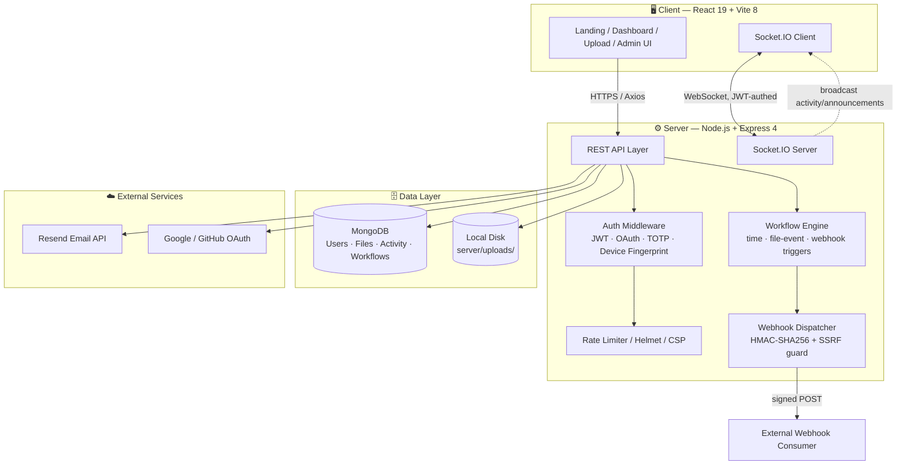
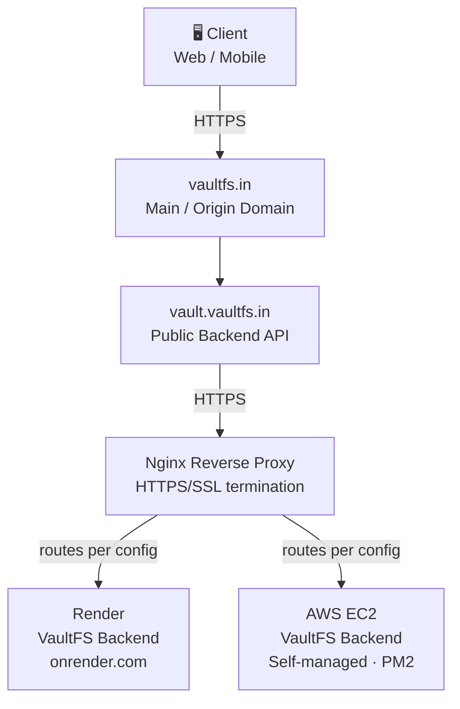
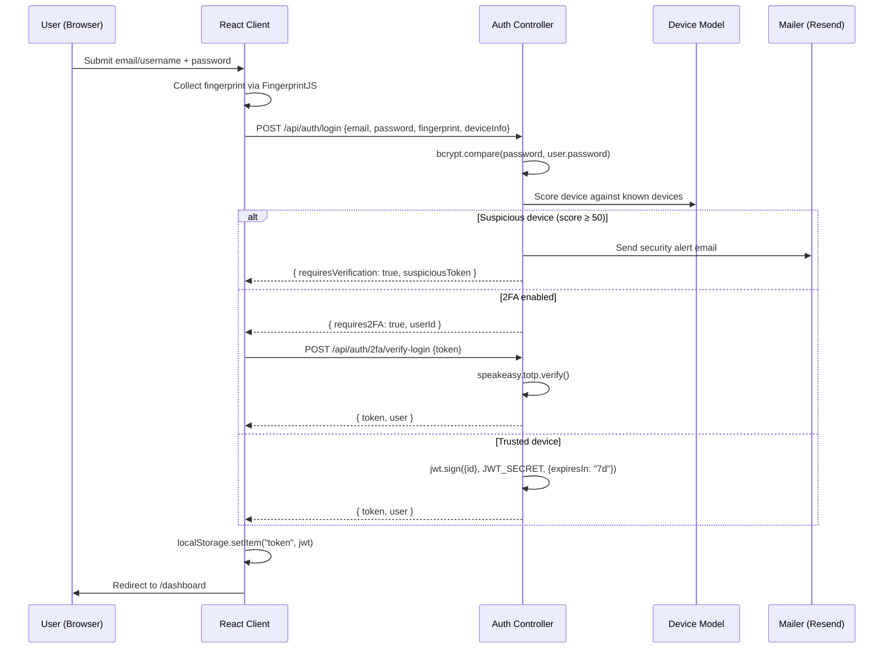
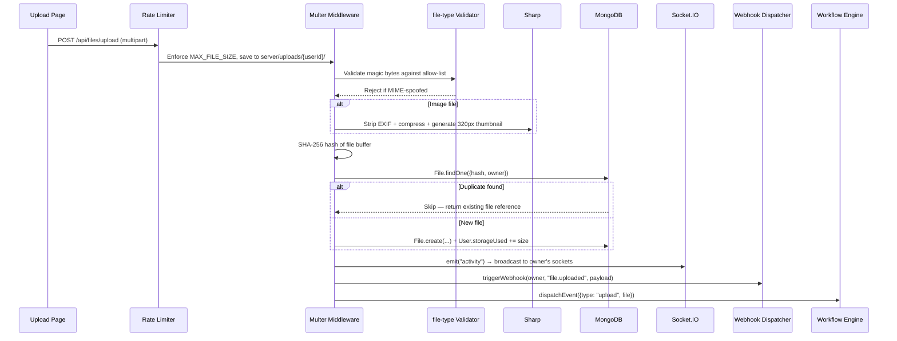
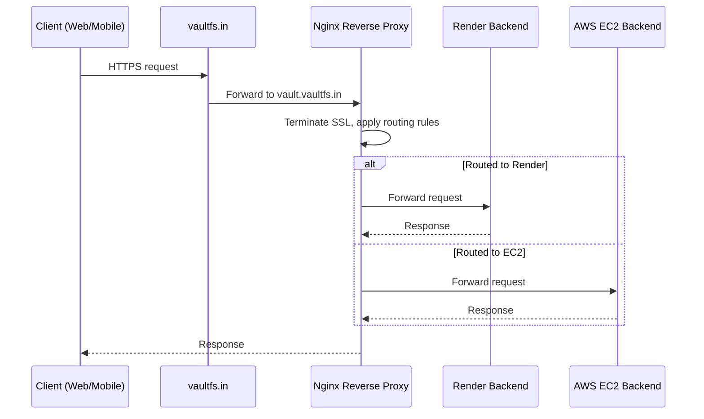

<div align="center">

# 🔐 VaultFS

### Enterprise-Grade Self-Hosted File Management System

[](https://nodejs.org)
[](https://reactjs.org)
[](https://mongodb.com)
[](https://vitejs.dev)
[](https://socket.io)
[](https://tailwindcss.com)
[](https://expressjs.com)
[](./LICENSE)

<br/>

**Secure, real-time file collaboration for teams and organizations — self-hosted, zero vendor lock-in.**

Local & Supabase-compatible storage · SHA-256 deduplication · 4-tier RBAC · JWT + TOTP 2FA · Device-fingerprint login protection · Workflow automation engine · Signed webhooks

[](https://www.vaultfs.in)
&nbsp;&nbsp;&nbsp;
[](https://github.com/kanhaiyaray/VaultFS-Enterprise-File-Management-System)

</div>

---

## 📋 Table of Contents

- [What is VaultFS?](#-what-is-vaultfs)
- [Architecture](#-architecture)
- [Tech Stack](#-tech-stack)
- [Features](#-features)
- [In-Browser Preview Engine](#️-in-browser-preview-engine)
- [Admin Dashboard](#️-admin-dashboard)
- [Workflow Automation Engine](#-workflow-automation-engine)
- [Project Structure](#️-project-structure)
- [Quick Start](#-quick-start)
- [Deployment & Infrastructure](#-deployment--infrastructure)
- [Environment Variables](#️-environment-variables)
- [API Reference](#-api-reference)
- [Database Models](#️-database-models)
- [Security Implementation](#-security-implementation)
- [Key Data Flows](#-key-data-flows)
- [Development vs Production](#-development-vs-production)
- [NPM Scripts](#-npm-scripts)
- [Key Dependencies](#-key-dependencies)
- [Production Checklist](#️-production-checklist)
- [Roadmap](#️-roadmap)
- [Contributing](#-contributing)
- [License](#-license)

---

## 📦 What is VaultFS?

VaultFS is a **full-featured, self-hosted file management platform** built for teams and enterprises that want cloud-grade functionality without giving up control of their data.

| | |
|---|---|
| 🗄️ **Your storage** | Files live on your own disk by default (`server/uploads/`), with optional Supabase/S3-compatible storage — no mandatory third-party file host |
| 🗃️ **Your database** | Metadata stays in your own MongoDB instance |
| 🔐 **Your governance** | Auth, sharing, retention, and automation workflows are entirely under your control |

Out of the box it ships with a modern dark/light UI, real-time updates via Socket.IO, advanced sharing controls, full file versioning, boolean full-text search, an in-browser preview engine for 9+ file types, client-side end-to-end encryption, a visual workflow automation builder, and a complete admin dashboard — with zero vendor lock-in.

Live at **[vaultfs.in](https://www.vaultfs.in)**, with the production API served at `vault.vaultfs.in` through a Nginx reverse proxy that fronts backend deployments on both **Render** and **AWS EC2** (kept alive with **PM2**). See [Deployment & Infrastructure](#-deployment--infrastructure) for the full picture.

---

## 🏗️ Architecture


```mermaid
flowchart TB
    subgraph Client["🖥️ Client — React 19 + Vite 8"]
        UI[Landing / Dashboard / Upload / Admin UI]
        SocketClient[Socket.IO Client]
    end

    subgraph Server["⚙️ Server — Node.js + Express 4"]
        API[REST API Layer]
        Auth[Auth Middleware<br/>JWT · OAuth · TOTP · Device Fingerprint]
        RateLimit[Rate Limiter / Helmet / CSP]
        SocketServer[Socket.IO Server]
        WorkflowEngine[Workflow Engine<br/>time · file-event · webhook triggers]
        WebhookDispatcher[Webhook Dispatcher<br/>HMAC-SHA256 + SSRF guard]
    end

    subgraph Data["🗄️ Data Layer"]
        Mongo[(MongoDB<br/>Users · Files · Activity · Workflows)]
        Disk[(Local Disk<br/>server/uploads/)]
    end

    subgraph External["☁️ External Services"]
        Resend[Resend Email API]
        OAuthProviders[Google / GitHub OAuth]
    end

    UI -->|HTTPS / Axios| API
    SocketClient <-->|WebSocket, JWT-authed| SocketServer
    API --> Auth --> RateLimit
    API --> Mongo
    API --> Disk
    API --> Resend
    API --> OAuthProviders
    API --> WorkflowEngine --> WebhookDispatcher
    SocketServer -.->|broadcast activity/announcements| SocketClient
    WebhookDispatcher -->|signed POST| ExternalConsumer[External Webhook Consumer]
```

---

## 🧱 Tech Stack

| Layer | Technology | Purpose |
|---|---|---|
| **Frontend** | React 19 + Vite 8 + Tailwind CSS 3 + React Router 7 | UI, routing, styling |
| **Real-time** | Socket.IO Client / Server 4 | Live activity feeds, announcements, notifications |
| **Backend** | Node.js 20+ + Express 4 | REST API, business logic |
| **Database** | MongoDB 6+ with Mongoose ODM | Persistent data storage |
| **Auth** | JWT (localStorage) + Passport.js (Google/GitHub) + TOTP (speakeasy) + bcryptjs | Sessions, OAuth, 2FA |
| **Device Security** | FingerprintJS + `ua-parser-js` + custom suspicion scoring | New-device detection & step-up verification |
| **Storage** | Local disk (default) with pluggable `storageProvider` field for cloud backends | File storage with quota enforcement |
| **File Processing** | Sharp (thumbnails/EXIF strip) + Multer (uploads) + `file-type` (magic-byte validation) + archiver + unzipper | Upload pipeline |
| **Email** | Resend API (`utils/sendMail.js`) | Transactional email — verification, resets, alerts |
| **Preview Engines** | marked.js + Prism.js + mammoth.js + SheetJS (xlsx) + JSZip + epub.js | In-browser previews for docs, sheets, slides, code, ebooks |
| **Client-side Crypto** | Web Crypto API (AES-256-GCM + PBKDF2) | Optional end-to-end file encryption before upload |
| **Automation** | Custom Workflow Engine (`utils/workflowEngine.js`) | Time / file-event / webhook-triggered actions with approval gating |
| **Security** | Helmet.js (CSP) + express-rate-limit + HMAC-SHA256 + SSRF-safe URL fetchers | Hardened HTTP layer |
| **Charts** | Recharts | Admin & analytics dashboards |
| **Drag & drop** | react-dropzone + react-dnd | Uploads and workflow builder |
| **Deployment** | AWS EC2 + Render + Nginx Reverse Proxy + PM2 | Dual backend deployment behind a reverse proxy on a dedicated API subdomain, with PM2 process supervision on EC2 |

---

## ✨ Features

<details open>
<summary><strong>🔐 Authentication & Security</strong></summary>
<br/>

- **JWT sessions** — 7-day expiry (configurable), Bearer-token auth
- **OAuth 2.0** — Google and GitHub sign-in via Passport.js
- **TOTP Two-Factor Authentication** — speakeasy-based, RFC 6238, QR code setup, dedicated disable flow
- **Device fingerprinting** — FingerprintJS + heuristic scoring (new device, timezone/platform change, login velocity) triggers a step-up email verification flow for suspicious logins
- **Separate Admin Portal** (`/admin/login`) with its own branding and role gate
- **Password reset & email verification** — token-based, hashed, time-boxed flows via Resend
- **Rate limiting** — dedicated limiters for auth (10/15min), uploads (10/min), downloads (30/min), and general API (200/15min)
- **Permanent & time-based user bans**, forced password resets, and account impersonation — all from the admin panel
- **GDPR-style compliance** — full account data export (JSON) and self-service account deletion

</details>

<details>
<summary><strong>📁 File Management</strong></summary>
<br/>

- **Drag-and-drop upload** (single files or entire folders) with real-time progress
- **Import from URL** — pull files directly from any public URL, with SSRF-safe DNS/IP validation
- **Client-side end-to-end encryption** — AES-256-GCM + PBKDF2, password never leaves the browser
- **File versioning** — full version history with one-click restore
- **SHA-256 deduplication** — duplicate uploads are detected and rejected per-user
- **Bulk operations** — multi-select delete, ZIP download, bulk tag add/remove, batch rename
- **30-day soft-delete trash** with restore or permanent deletion, plus an empty-trash action
- **Starred files** and custom color labels per file
- **Smart Folders** — client-side, rule-based virtual collections (type, tag, date, size, starred)
- **Side-by-side file diff viewer** — LCS-based text diff for comparing two files or two versions

</details>

<details>
<summary><strong>🔗 Sharing & Collaboration</strong></summary>
<br/>

- **Advanced share links** — password protection, expiry presets, download limits, view-only mode
- **Public gallery** of shared files, browsable without an account
- **Team workspaces** with role-based access: `owner` · `admin` · `editor` · `viewer`
- **File Requests** — public upload slugs (`/r/:slug`) accepting submissions from unauthenticated users, with email capture, per-file size limits, and MIME-type restrictions
- **Real-time activity feed & broadcast announcements** — Socket.IO pushes instantly to all connected clients, filterable by role
- **Webhooks** — HMAC-SHA256 signed payloads with per-event filtering and SSRF-guarded delivery

</details>

<details>
<summary><strong>🔍 Organization, Search & Automation</strong></summary>
<br/>

- **Full-text search** with boolean operators (`AND` / `OR` / `NOT`), MIME/tag/date filters, and saved searches
- **Smart Folders** — client-side virtual collections from customizable rules
- **Visual Workflow Builder** (admin) — drag-and-drop actions (notify, delete, backup, report, approval, branch) triggered by schedules, file events, or inbound webhooks
- **Approval-gated workflows** — sensitive actions can require admin sign-off before executing
- **Tags, descriptions, and aliases** — manual organization plus relationship linking between files

</details>

---

## 🖼️ In-Browser Preview Engine

| File Type | Technology | Notes |
|---|---|---|
| Images (JPG, PNG, WEBP) | Sharp server-side thumbnails | EXIF stripped, auto-compressed on upload |
| Video / Audio | HTML5 `<video>` / `<audio>` | Native browser playback |
| PDF | Embedded `<iframe>` viewer | No plugin required |
| DOCX | mammoth.js → HTML (client-side) | Preserves basic formatting |
| XLSX / CSV | SheetJS → interactive, sheet-tabbed table | Handles up to 500 rows inline |
| PPTX | JSZip → extracted slide text | Text-only extraction, per-slide cards |
| Code (30+ languages) | Prism.js syntax highlighting + line numbers | Copy, download, word-wrap toggle |
| Markdown | marked.js + DOMPurify sanitization | Live preview / edit / split view |
| EPUB | epub.js (client-side) | Full reader experience |

---

## 🛠️ Admin Dashboard

| Section | Capabilities |
|---|---|
| **Overview** | Storage/user stats, 30-day upload trend chart, file-type breakdown, top uploaders |
| **Users** | List, search, filter, create, edit, ban/unban (timed or permanent), force password reset, impersonate, CSV export |
| **Files** | Browse all files across all users, full-text search, delete, storage hogs, orphaned-file cleanup, duplicate detection |
| **Activity Log** | Full audit trail — filter by action, user, date range, free-text search |
| **Workflows** | Visual drag-and-drop builder for automated actions triggered by time, file events, or webhooks |
| **Announcements** | Broadcast in-app + email messages to all users or specific roles, with live removal |
| **Branding** | Custom app name, tagline, logo, favicon, colors, footer, feature toggles, maintenance mode |

---

## 🔄 Workflow Automation Engine

VaultFS ships a custom automation engine (`server/utils/workflowEngine.js`) that admins configure visually from **Admin → Workflows**.

- **Triggers**: `time` (daily/weekly/monthly schedules), `file_event` (upload, delete, share, metadata_update, any), or `webhook` (external POST with a shared secret)
- **Conditions**: filter by MIME type, tags, owner, filename, or description before actions run
- **Actions**: `notify` (email), `delete` (with retention windows), `backup` (local disk, optional S3), `report`, `approval` (human-in-the-loop gate), and `branch` (nested conditional sub-actions)
- **Approval gating**: workflows can require admin approval before executing, visible under pending approvals with full run history

---

## 🗂️ Project Structure

```
VaultFS/
├── client/                          # React 19 + Vite 8 frontend
│   ├── public/                      # robots.txt, sitemap.xml, static assets
│   ├── vercel.json                  # SPA rewrites for static file exclusion
│   ├── vite.config.js               # Vite build config + API proxy
│   └── src/
│       ├── components/              # 25+ reusable UI components
│       │   ├── AdvancedSearch.jsx
│       │   ├── AdvancedShareModal.jsx
│       │   ├── AnnouncementBanner.jsx
│       │   ├── BrandingProvider.jsx
│       │   ├── BulkTagEditor.jsx
│       │   ├── DeviceManagement.jsx
│       │   ├── EncryptionModal.jsx
│       │   ├── FileDiffViewer.jsx
│       │   ├── FileVersionHistory.jsx
│       │   ├── OfficePreview.jsx
│       │   ├── SmartFolders.jsx
│       │   ├── VirtualFileBrowser.jsx
│       │   └── WebhooksTab.jsx
│       ├── context/                 # AuthContext · ThemeContext · ActionHistoryContext
│       ├── hooks/                   # useSocket · useLocalStorage · useFileOrganizer
│       ├── pages/                   # 20 route-level page components (incl. LandingPage, AdminLoginPage, WorkflowBuilder)
│       └── utils/                   # api.js · helpers.js · encryption.js · deviceFingerprint.js
│
├── server/                          # Node.js / Express 4 API
│   ├── index.js                     # Express + Socket.IO entry point
│   ├── controllers/                 # admin · auth · file · webhook · workflow · share · notification
│   ├── models/                      # User · File · FileRequest · Webhook · Branding · Activity · Device · Workflow · Announcement · PasswordReset
│   ├── routes/                      # /api/auth · /api/files · /api/admin · /api/webhooks · /api/workflows ...
│   ├── middleware/                  # auth.js · upload.js (magic-byte validation) · rateLimiter.js
│   ├── utils/                       # activityLogger · sendMail (Resend) · passport · socket · workflowEngine
│   └── uploads/                     # ⚠️ Persistent volume required in production
│
├── package.json                     # Root workspace — runs client + server concurrently
├── export.js                        # Codebase export utility (dev tool)
└── README.md
```

---

## 🚀 Quick Start

### Prerequisites

| Requirement | Version | Notes |
|---|---|---|
| Node.js | 20+ | Required by Sharp |
| MongoDB | 6+ | Local instance or MongoDB Atlas |
| npm | 9+ | Comes with Node.js 20 |
| Resend API key | — | Required for email flows (verification, reset, alerts) |

### Installation

```bash
# 1. Clone the repository
git clone https://github.com/kanhaiyaray/VaultFS-Enterprise-File-Management-System.git
cd VaultFS-Enterprise-File-Management-System

# 2. Install all dependencies (root workspace + client/ + server/)
npm run install:all

# 3. Configure environment variables
cp server/.env.example server/.env
# Open server/.env and fill in your values

# 4. Start both servers in development mode
npm run dev
# → API server:    http://localhost:5000
# → React client:  http://localhost:5173
```

### Production Deployment (Local Build)

```bash
# 1. Build the React frontend (outputs to client/dist/)
npm run build

# 2. Start Express in production mode
NODE_ENV=production node server/index.js
```

> Always run behind a reverse proxy (nginx, Caddy) with SSL termination. For how the live `vaultfs.in` deployment is actually wired up across Render, AWS EC2, and Nginx, see [Deployment & Infrastructure](#-deployment--infrastructure) below.

---

## 🚀 Deployment & Infrastructure

The **VaultFS** production backend runs across **two environments simultaneously** — a managed instance on **Render** and a self-managed instance on **AWS EC2** — sitting behind a **Nginx reverse proxy** on a dedicated API subdomain. This gives the deployment both the convenience of a managed platform and the control of a self-managed server, without either being a single point of failure in the routing layer.

### 🌐 Domains & Backend Endpoints

| Purpose | Domain / Endpoint |
|---|---|
| Main / Origin Domain | `https://vaultfs.in` |
| Production Backend API | `https://vault.vaultfs.in` |
| Render Backend Instance | `https://vaultfs-enterprise-file-management.onrender.com` |
| AWS EC2 | Self-managed backend server |

### ☁️ Backend Deployment

**Render** — Managed cloud deployment. Render provides the managed hosting environment for one instance of the VaultFS backend at `vaultfs-enterprise-file-management.onrender.com`.

**AWS EC2** — Self-managed cloud server. The backend also runs on an AWS EC2 instance as a PM2-managed process (`pm2 start server/index.js --name vaultfs-api`), giving a self-managed environment where the application can be configured and controlled directly. PM2 handles process supervision — auto-restart on crash, `pm2 startup` for reboot persistence, and `pm2 logs` for monitoring.

### 🔀 Domain Routing & Reverse Proxy

Instead of exposing either backend server (and its internal ports) directly to clients, all traffic is routed through a **Nginx reverse proxy** sitting in front of both deployments:


```mermaid
flowchart TB
    Client["🖥️ Client<br/>Web / Mobile"]
    Origin["vaultfs.in<br/>Main / Origin Domain"]
    API["vault.vaultfs.in<br/>Public Backend API"]
    Proxy["Nginx Reverse Proxy<br/>HTTPS/SSL termination"]
    Render["Render<br/>VaultFS Backend<br/>onrender.com"]
    EC2["AWS EC2<br/>VaultFS Backend<br/>Self-managed · PM2"]

    Client -->|HTTPS| Origin
    Origin --> API
    API -->|HTTPS| Proxy
    Proxy -->|routes per config| Render
    Proxy -->|routes per config| EC2
```

The reverse proxy is responsible for:

- 🔐 Handling incoming **HTTPS/SSL** connections
- 🌐 Managing custom domain routing
- 🔀 Forwarding API requests to the appropriate backend
- 🛡️ Hiding backend server details from public clients
- 🚪 Preventing direct exposure of internal application ports
- ⚙️ Centralizing backend routing and traffic management
- 🔄 Supporting multiple backend deployments (Render + EC2) behind one address

This lets clients talk to a single, stable address — `https://vault.vaultfs.in` — without needing to know whether a given request is ultimately served by the Render deployment or the AWS EC2 server.

> **Note:** The exact routing behavior between Render and AWS EC2 depends on the reverse proxy configuration. If configured for failover or load balancing, traffic is distributed across both deployments. If configured for a specific upstream, requests are forwarded according to those fixed rules.

### 📡 Production API

The recommended public API endpoint for client applications is:

```
https://vault.vaultfs.in
```

The Render deployment also has its own direct service URL, `https://vaultfs-enterprise-file-management.onrender.com`, which is useful for direct service access and testing — while the custom domain provides a consistent, production-facing API endpoint for the actual app.

### 🛡️ Why Use a Custom API Domain?

Routing through `vault.vaultfs.in` instead of exposing the Render or EC2 address directly provides several advantages:

- Consistent API endpoint for frontend applications
- Infrastructure can change without changing client configuration
- Backend server details remain abstracted
- HTTPS can be centrally managed
- The reverse proxy can control backend routing
- Easier migration between hosting providers
- Supports multiple backend deployments at once

### 🔐 Secrets & Credentials

Sensitive infrastructure information must never be committed to the repository. Never commit:

API keys · Database credentials · JWT secrets · AWS access keys · SSH private keys · SSL/TLS private keys · `.env` files containing secrets · Internal server credentials

Use environment variables and the secure configuration/secrets managers provided by **Render** and **AWS EC2** instead (see [Environment Variables](#️-environment-variables) and the [Production Checklist](#️-production-checklist)).

### 📊 Infrastructure Summary

| Component | Purpose |
|---|---|
| `vaultfs.in` | Main / origin domain |
| `vault.vaultfs.in` | Public production backend API |
| `vaultfs-enterprise-file-management.onrender.com` | Render backend deployment |
| AWS EC2 | Self-managed backend deployment |
| Nginx Reverse Proxy | Routes incoming requests to backend services, terminates HTTPS |
| Render | Managed backend hosting |
| PM2 (on EC2) | Process supervision — auto-restart, reboot persistence, log monitoring |

---

## ⚙️ Environment Variables

<details>
<summary><strong>server/.env</strong> — click to expand</summary>

```env
# ── Server ────────────────────────────────────────────
PORT=5000
NODE_ENV=development
CLIENT_URL=http://localhost:5173

# ── MongoDB ───────────────────────────────────────────
MONGO_URI=mongodb://127.0.0.1:27017/vaultfs

# ── JWT ───────────────────────────────────────────────
JWT_SECRET=replace_with_a_long_random_secret_string_here   # openssl rand -hex 64
JWT_EXPIRES_IN=7d

# ── Email (Resend) ────────────────────────────────────
RESEND_API_KEY=re_xxxxxxxxxxxxxxxxxxxxxxxx
EMAIL_FROM="VaultFS <onboarding@resend.dev>"

# ── OAuth — Google (optional) ─────────────────────────
GOOGLE_CLIENT_ID=
GOOGLE_CLIENT_SECRET=
GOOGLE_CALLBACK_URL=http://localhost:5000/api/auth/google/callback

# ── OAuth — GitHub (optional) ─────────────────────────
GITHUB_CLIENT_ID=
GITHUB_CLIENT_SECRET=
GITHUB_CALLBACK_URL=http://localhost:5000/api/auth/github/callback

# ── File Storage ──────────────────────────────────────
UPLOAD_DIR=./uploads
MAX_FILE_SIZE=52428800            # 50 MB in bytes (per-route override up to 500MB supported)
DEFAULT_STORAGE_LIMIT=5368709120  # 5 GB per user, in bytes

# ── Password Reset ────────────────────────────────────
RESET_TOKEN_EXPIRES_HOURS=2

# ── Webhooks ──────────────────────────────────────────
WEBHOOK_SECRET=replace_with_webhook_signing_secret
WEBHOOK_ALLOW_HTTP=false          # set true only for local webhook testing

# ── Branding (optional defaults) ──────────────────────
APP_NAME=VaultFS
APP_PRIMARY_COLOR=#6366f1
```
</details>

<details>
<summary><strong>client/.env</strong> — click to expand</summary>

```env
# Vite environment variables (must start with VITE_)
# In development, the Vite proxy handles API calls — leave VITE_API_URL empty.
# In production, set it to your deployed API URL.
VITE_API_URL=
VITE_SOCKET_URL=
```
</details>

---

## 📡 API Reference

<details>
<summary><strong>Public Endpoints</strong> (no auth required)</summary>

| Method | Endpoint | Description |
|---|---|---|
| GET | `/api/branding` | Retrieve public branding configuration |
| GET | `/api/files/share/:token` | Get share link metadata |
| POST | `/api/files/share/:token/access` | Unlock a password-protected share link |
| GET | `/api/file-requests/:slug` | Get public file request info |
| POST | `/api/file-requests/:slug/submit` | Submit files to a public request |
| GET | `/api/files/public/gallery` | Browse public gallery (with search) |
| GET | `/api/health` | Server health check |

</details>

<details>
<summary><strong>Auth Endpoints</strong> — <code>/api/auth/*</code></summary>

| Method | Endpoint | Description |
|---|---|---|
| POST | `/register` | Register new user account |
| POST | `/login` | Login with device fingerprint check |
| GET | `/me` | Get current authenticated user |
| PUT | `/change-password` | Change password (authenticated) |
| POST | `/forgot-password` | Send password reset email |
| POST | `/reset-password` | Reset password with token |
| GET | `/verify-email` | Verify email address |
| POST | `/resend-verification` | Resend verification email |
| POST | `/2fa/setup` | Generate TOTP secret + QR code |
| POST | `/2fa/verify` | Verify TOTP token, enable 2FA |
| POST | `/2fa/verify-login` | Complete login after 2FA challenge |
| POST | `/2fa/disable` | Disable 2FA (requires current TOTP) |
| POST | `/verify-suspicious` | Confirm a suspicious-login device |
| GET | `/google`, `/github` | Initiate OAuth2 flow |
| GET | `/google/callback`, `/github/callback` | OAuth2 callback |

</details>

<details>
<summary><strong>File Endpoints</strong> — <code>/api/files/*</code></summary>

| Method | Endpoint | Description |
|---|---|---|
| POST | `/upload` | Upload file(s) (multipart/form-data) |
| POST | `/upload-encrypted` | Upload client-side E2E encrypted file(s) |
| POST | `/upload-from-url` | Import file from a public URL (SSRF-guarded) |
| GET | `/` | List files with filters, pagination, sorting |
| GET | `/search` | Boolean full-text search (AND/OR/NOT, filters) |
| GET | `/stats` | Personal usage stats and upload trend |
| GET | `/trash` | List soft-deleted files |
| GET | `/starred` | List starred files |
| GET | `/:id` | Get single file metadata |
| GET | `/:id/signed-url` | Get a short-lived signed access URL |
| GET | `/download/:id` | Stream file download |
| PUT | `/:id` | Update name, tags, description, labels |
| DELETE | `/:id` | Soft-delete to trash |
| POST | `/:id/restore` | Restore from trash |
| DELETE | `/:id/permanent` | Permanently delete |
| DELETE | `/empty-trash` | Empty trash entirely |
| POST | `/:id/star` / DELETE `/:id/star` | Star / unstar a file |
| PUT | `/:id/version` | Upload a new version |
| POST | `/:id/version/:versionIndex/restore` | Restore a specific version |
| GET | `/:id/access-logs` | Per-file access log |
| POST | `/:id/extract` | Extract a ZIP archive into new files |
| POST | `/:id/share` | Create an advanced share link |
| POST | `/:id/unlock` | Verify a password-protected share |
| POST | `/bulk-delete` / `/bulk-download` / `/bulk-tags` / `/batch-rename` | Bulk operations |
| GET | `/public/gallery` | Public gallery listing |

</details>

<details>
<summary><strong>Webhook Endpoints</strong> — <code>/api/webhooks/*</code></summary>

| Method | Endpoint | Description |
|---|---|---|
| GET | `/` | List all webhook endpoints |
| POST | `/` | Create webhook endpoint (max 10 per account) |
| PUT | `/:id` | Update webhook config |
| DELETE | `/:id` | Delete webhook endpoint |
| POST | `/:id/test` | Send a signed test delivery |

</details>

<details>
<summary><strong>Workflow Endpoints</strong> — <code>/api/workflows/*</code> (admin only, except inbound webhook trigger)</summary>

| Method | Endpoint | Description |
|---|---|---|
| POST | `/webhook/:path` | Public inbound trigger for webhook-type workflows |
| GET | `/` | List all workflows |
| GET | `/pending-approvals` | List workflows awaiting approval |
| POST | `/` | Create a workflow |
| GET | `/:id` | Get a single workflow |
| PUT | `/:id` | Update a workflow |
| DELETE | `/:id` | Delete a workflow |
| POST | `/:id/run` | Manually run a workflow |
| POST | `/:id/approve` / `/:id/reject` | Approve or reject a pending run |

</details>

<details>
<summary><strong>Admin Endpoints</strong> — <code>/api/admin/*</code> (requires <code>role: "admin"</code>)</summary>

| Method | Endpoint | Description |
|---|---|---|
| GET | `/users` | List all users (search, filter, sort, paginate) |
| POST | `/users/create` | Create user account manually |
| GET / PUT / DELETE | `/users/:id` | View, edit, or delete a user account |
| POST | `/users/:id/ban` / `/unban` | Ban/unban user (permanent or timed) |
| POST | `/users/:id/force-reset` | Force password reset email |
| POST | `/users/:id/impersonate` | Generate impersonation JWT (2h) |
| GET | `/users/:id/activities` | Per-user activity log |
| GET | `/users/export` | CSV export of all users |
| GET | `/files` | Browse all files across all users |
| GET | `/files/search` | Admin full-text file search |
| GET | `/files/storage-hogs` | Largest files across the system |
| GET | `/files/orphaned` | Files on disk with no owning user |
| POST | `/files/orphaned/cleanup` | Clean all orphaned files |
| GET | `/files/duplicates` | Exact + near-duplicate detection |
| DELETE | `/files/:id` | Admin-delete any file |
| GET | `/stats` | System metrics, upload trends, MIME breakdown |
| GET | `/activities` / `/activities/stats` | Full audit log + aggregated stats |
| POST | `/announce` | Broadcast an announcement |
| GET | `/announcements` | List all announcements |
| DELETE | `/announcements/:id` | Remove announcement |
| GET / PUT | `/branding` | View / update branding, feature flags, limits |

</details>

---

## 🗄️ Database Models

<details>
<summary><strong>User</strong> (<code>server/models/User.js</code>)</summary>

```js
{
  username: String,   // unique, indexed
  email:    String,   // unique, indexed, lowercase
  password: String,   // bcrypt hash (12 rounds), select:false
  displayName: String,
  avatarUrl:   String,
  role:         String,   // "user" | "admin"
  emailVerified: Boolean,
  emailVerifyToken: String,   // select:false
  googleId: String, githubId: String,
  twoFactorEnabled: Boolean,
  twoFactorSecret:  String,   // select:false
  storageUsed:  Number,       // bytes
  storageLimit: Number,       // bytes (default 5GB)
  uploadCount:  Number,
  isBanned: Boolean, banReason: String, banUntil: Date,
  lastLoginAt: Date, lastLoginIp: String,
  notificationPrefs: {
    emailOnDownload: Boolean, emailOnShare: Boolean, emailOnFileRequest: Boolean,
    emailOnLogin: Boolean, emailWeeklySummary: Boolean,
    inAppActivity: Boolean, inAppAnnouncements: Boolean,
  },
  customLabels: [{ name: String, color: String }],
  createdAt: Date, updatedAt: Date
}
```
</details>

<details>
<summary><strong>File</strong> (<code>server/models/File.js</code>)</summary>

```js
{
  filename: String, originalName: String, mimetype: String, size: Number,
  path: String, url: String,
  owner:  ObjectId,   // ref: User, indexed
  tags: [String], description: String,
  thumbnailPath: String, thumbnailUrl: String,
  metadata: { width: Number, height: Number, exifStripped: Boolean, compressed: Boolean, originalSize: Number },
  aiDescription: String,
  hash: String,       // SHA-256, indexed (dedup key)
  isDedup: Boolean,
  previousVersions: [{ filename, originalName, size, path, url, hash, uploadedAt, uploadedBy, note }],
  isPublic: Boolean,
  shareToken: String, shareExpiry: Date,
  sharePassword: String,   // select:false
  shareMaxDownloads: Number, shareDownloadCount: Number, shareViewOnly: Boolean,
  isDeleted: Boolean, deletedAt: Date,   // soft delete / trash
  starredBy: [ObjectId],
  labels: [{ name: String, color: String }],
  isEncrypted: Boolean, encryptionIV: String,
  scanStatus: String,   // "pending" | "clean" | "infected" | "error"
  accessLogs: [{ user, action, ip, userAgent, at }],
  storageProvider: String,   // "local" | "supabase"
  storagePath: String,
  createdAt: Date, updatedAt: Date
}
```
</details>

<details>
<summary><strong>Workflow</strong> (<code>server/models/Workflow.js</code>)</summary>

```js
{
  name: String, description: String, createdBy: ObjectId, isActive: Boolean,
  trigger: { type: "time" | "file_event" | "webhook", scheduleType, scheduleTime, daysOfWeek, event, webhookPath, webhookSecret },
  condition: { field, operator, value },
  actions: [{ type: "notify" | "delete" | "backup" | "report" | "approval" | "branch", label, params }],
  approval: { required: Boolean, reviewers: [ObjectId], note: String },
  pendingApproval: { status, requestedBy, requestedAt, payload, note, reviewedBy, reviewedAt, decision },
  runHistory: [{ status, triggerType, triggerPayload, logs, result, startedAt, completedAt }],
  lastRunAt: Date, nextRunAt: Date
}
```
</details>

<details>
<summary><strong>Branding</strong> (<code>server/models/Branding.js</code>)</summary>

```js
{
  appName: String, primaryColor: String, accentColor: String,
  logoUrl: String, faviconUrl: String, tagline: String, footerText: String,
  maintenanceMode: Boolean, maintenanceMessage: String,
  features: { urlImport, publicGallery, twoFactor, teamCollaboration, fileRequests, officePreview, registration },
  limits: { maxFileSizeMB, storageLimitGB, uploadRatePerMin },
  allowedMimeTypes: [String]   // validated against an unsafe-type blocklist (no HTML/JS/SVG)
}
```
</details>

---

## 🔒 Security Implementation

| Feature | Implementation | Detail |
|---|---|---|
| Password hashing | bcryptjs · 12 salt rounds | Constant-time `bcrypt.compare()` |
| Session tokens | JWT signed with `JWT_SECRET` | 7-day expiry (configurable) · Bearer header |
| Content Security Policy | Helmet.js, explicit `connectSrc`/`frameAncestors` allow-list | Restricts script/style/frame origins |
| Two-Factor Auth | TOTP via speakeasy (RFC 6238) | 30-second window · QR code setup, separate disable challenge |
| Device trust & anomaly detection | FingerprintJS + heuristic scoring in `authController.js` | New device, timezone/platform drift, and login velocity raise a suspicion score; ≥50 triggers step-up email verification |
| File access control | Ownership verified on every request | Signed, time-limited access tokens for shares & previews |
| Rate limiting | express-rate-limit, per-route limiters | 10 uploads/min · 30 downloads/min · 10 auth attempts/15min · 200 general requests/15min |
| Magic-byte validation | `file-type` library on every upload | Rejects MIME-spoofed files even with a "safe" extension |
| SSRF protection | DNS resolution + private-IP filtering | Applied to both "import from URL" uploads and webhook delivery |
| Security headers | Helmet.js | CSP · X-Frame-Options · X-Content-Type-Options |
| CORS | Explicit allow-list of production + dev origins | All other origins rejected |
| Webhook signing | HMAC-SHA256 per-endpoint secret | Consumers verify `X-VaultFS-Signature`; HTTPS enforced by default |
| Encryption at rest (optional) | AES-256-GCM + PBKDF2 via Web Crypto API | Fully client-side — password never transmitted |
| Admin isolation | Separate `/admin/login` portal with role gate | Non-admin credentials are rejected even with valid password |
| Impersonation | Time-boxed (2h) JWT, admin-only, cannot target other admins | Full audit trail via Activity log |
| Transport security | Nginx-terminated HTTPS/SSL at the reverse proxy | See [Deployment & Infrastructure](#-deployment--infrastructure) |

---

## 🔄 Key Data Flows

### Authentication (with Device Fingerprinting + 2FA)


```mermaid
sequenceDiagram
    participant U as User (Browser)
    participant C as React Client
    participant A as Auth Controller
    participant D as Device Model
    participant M as Mailer (Resend)

    U->>C: Submit email/username + password
    C->>C: Collect fingerprint via FingerprintJS
    C->>A: POST /api/auth/login {email, password, fingerprint, deviceInfo}
    A->>A: bcrypt.compare(password, user.password)
    A->>D: Score device against known devices

    alt Suspicious device (score ≥ 50)
        A->>M: Send security alert email
        A-->>C: { requiresVerification: true, suspiciousToken }
    else 2FA enabled
        A-->>C: { requires2FA: true, userId }
        C->>A: POST /api/auth/2fa/verify-login {token}
        A->>A: speakeasy.totp.verify()
        A-->>C: { token, user }
    else Trusted device
        A->>A: jwt.sign({id}, JWT_SECRET, {expiresIn: "7d"})
        A-->>C: { token, user }
    end

    C->>C: localStorage.setItem("token", jwt)
    C->>U: Redirect to /dashboard
```

### File Upload Pipeline (with Deduplication + Magic-Byte Validation)


```mermaid
sequenceDiagram
    participant U as Upload Page
    participant RL as Rate Limiter
    participant M as Multer Middleware
    participant V as file-type Validator
    participant S as Sharp
    participant DB as MongoDB
    participant WS as Socket.IO
    participant WH as Webhook Dispatcher
    participant WF as Workflow Engine

    U->>RL: POST /api/files/upload (multipart)
    RL->>M: Enforce MAX_FILE_SIZE, save to server/uploads/{userId}/
    M->>V: Validate magic bytes against allow-list
    V-->>M: Reject if MIME-spoofed
    alt Image file
        M->>S: Strip EXIF + compress + generate 320px thumbnail
    end
    M->>M: SHA-256 hash of file buffer
    M->>DB: File.findOne({hash, owner})
    alt Duplicate found
        DB-->>M: Skip — return existing file reference
    else New file
        M->>DB: File.create(...) + User.storageUsed += size
    end
    M->>WS: emit("activity") → broadcast to owner's sockets
    M->>WH: triggerWebhook(owner, "file.uploaded", payload)
    M->>WF: dispatchEvent({type: "upload", file})
```

### Request Routing (Client → Reverse Proxy → Backend)


```mermaid
sequenceDiagram
    participant C as Client (Web/Mobile)
    participant O as vaultfs.in
    participant P as Nginx Reverse Proxy
    participant R as Render Backend
    participant E as AWS EC2 Backend

    C->>O: HTTPS request
    O->>P: Forward to vault.vaultfs.in
    P->>P: Terminate SSL, apply routing rules
    alt Routed to Render
        P->>R: Forward request
        R-->>P: Response
    else Routed to EC2
        P->>E: Forward request
        E-->>P: Response
    end
    P-->>C: Response
```

---

## 🧪 Development vs Production

| Aspect | Development | Production |
|---|---|---|
| `NODE_ENV` | `development` | `production` |
| API routing | Vite dev server proxies `/api`, `/uploads`, `/socket.io` → `localhost:5000` | Nginx reverse proxy → `vault.vaultfs.in` → Render / AWS EC2 |
| File storage | `server/uploads/` on local disk | **Persistent volume required** (NFS, EBS, EFS…) |
| Email delivery | Resend API (same in both environments) | Resend API — set `RESEND_API_KEY` |
| CSP headers | Relaxed for Vite HMR | Full Helmet.js protection with explicit origins |
| Error responses | Full error message | Generic message; stack hidden |
| Process management | `nodemon` auto-restart | PM2 (EC2) / platform-managed (Render) |

---

## 📜 NPM Scripts

| Command | Description |
|---|---|
| `npm run install:all` | Install dependencies in root, `client/`, and `server/` |
| `npm run dev` | Run Vite dev server + Express with nodemon concurrently |
| `npm run build` | Build optimized production frontend bundle → `client/dist/` |
| `npm run server` | Start backend only in dev mode (nodemon auto-restart) |
| `npm run client` | Start Vite frontend dev server only |
| `cd client && npm run lint` | ESLint check across the frontend codebase |
| `npm run start` | Production backend start (no nodemon) |

---

## 🙏 Key Dependencies

<details>
<summary><strong>Frontend</strong> (<code>client/package.json</code>)</summary>

| Library | Purpose |
|---|---|
| `react` 19 + `react-dom` | Core UI library |
| `vite` 8 | Build tool + HMR dev server |
| `tailwindcss` 3 | Utility-first CSS framework |
| `react-router-dom` 7 | Client-side routing |
| `socket.io-client` | Real-time WebSocket client |
| `axios` | HTTP client with JWT interceptors |
| `lucide-react` | SVG icon set |
| `recharts` | Admin dashboard charts |
| `react-dropzone` | Drag-and-drop upload zone |
| `react-dnd` | Drag-and-drop workflow builder |
| `@fingerprintjs/fingerprintjs` | Device fingerprinting |
| `dompurify` | Sanitizing rendered markdown HTML |
| `marked` / `mammoth` / `xlsx` / `jszip` / `qrcode.react` | Preview & 2FA QR engines |

</details>

<details>
<summary><strong>Backend</strong> (<code>server/package.json</code>)</summary>

| Library | Purpose |
|---|---|
| `express` | HTTP server + REST API framework |
| `mongoose` | MongoDB ODM |
| `socket.io` | WebSocket server for real-time events |
| `passport` + `passport-google-oauth20` + `passport-github2` | OAuth2 strategies |
| `jsonwebtoken` | JWT generation and verification |
| `bcryptjs` | Password hashing (12 rounds) |
| `speakeasy` + `qrcode` | TOTP 2FA implementation |
| `multer` + `sharp` | Upload pipeline, thumbnails, EXIF strip |
| `file-type` | Magic-byte validation for uploads |
| `resend` | Transactional email delivery |
| `helmet` + `express-rate-limit` | Hardened HTTP layer |
| `archiver` + `unzipper` | ZIP creation / extraction |
| `ua-parser-js` | Device/browser parsing for fingerprint scoring |
| `is-ip` | SSRF guard helper for URL imports & webhooks |

</details>

---

## ⚠️ Production Checklist

- [ ] **Persistent file storage** — mount an external volume (NFS, AWS EBS, Azure Disk) for `server/uploads/`; without it, every container/instance restart wipes uploaded files
- [ ] **JWT secret** — set `JWT_SECRET` to a cryptographically random 64+ character string (`openssl rand -hex 64`); never commit it
- [ ] **Resend configured** — password reset, email verification, share notifications, and suspicious login alerts all depend on `RESEND_API_KEY`
- [ ] **Reverse proxy** — run behind nginx/Caddy with SSL/TLS; forward `X-Forwarded-For` / `X-Real-IP` so rate limiting applies per real client IP
- [ ] **Dual-backend routing** — if running both Render and AWS EC2 behind the reverse proxy, confirm whether it's configured for failover, load balancing, or a fixed upstream, and that both instances share the same environment configuration
- [ ] **Horizontal scaling plan** — local disk is single-node only; use shared network storage for multi-instance deployments
- [ ] **First admin account** — the first registered user does **not** automatically become admin; promote via direct DB update or the admin API once one admin exists
- [ ] **CORS allow-list** — update the hardcoded origin list in `server/index.js` to match your production domains
- [ ] **No secrets in the repo** — API keys, DB credentials, JWT secrets, AWS keys, SSH/TLS private keys, and `.env` files must stay out of version control; use each platform's environment/secrets configuration instead

---

## 🗺️ Roadmap

- [ ] First-class S3-compatible storage provider (beyond the existing `storageProvider` field)
- [ ] Real-time collaborative document editing for text/markdown files
- [ ] Mobile-responsive PWA build
- [ ] SSO / SAML support for enterprise deployments
- [ ] Automated test suite (Jest + Supertest for API, Playwright for E2E)

---

## 🤝 Contributing

Contributions, issues, and feature requests are welcome. Please check the [issues page](https://github.com/kanhaiyaray/VaultFS-Enterprise-File-Management-System/issues) before opening a new one.

1. Fork the repository
2. Create a feature branch: `git checkout -b feature/my-feature`
3. Commit your changes: `git commit -m 'feat: add my feature'`
4. Push to the branch: `git push origin feature/my-feature`
5. Open a Pull Request against `main`

Please follow the existing code style and add comments for any non-obvious logic.

---

## 📄 License

Released under the **[MIT License](./LICENSE)** — for personal and commercial use.

---

<div align="center">

Built with ❤️ for secure, self-hosted file management

**VaultFS** — Your files. Your server. Your rules.

🌐 [vaultfs.in](https://www.vaultfs.in) &nbsp;·&nbsp; 🔗 [GitHub](https://github.com/kanhaiyaray/VaultFS-Enterprise-File-Management-System)

</div>
